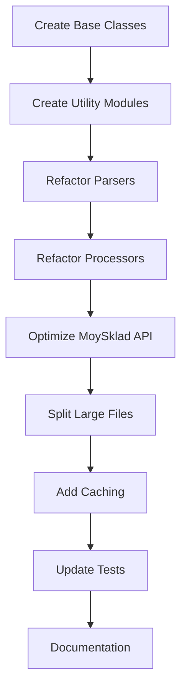

# Code Optimization and Deduplication Plan

## Executive Summary

The project has significant code duplication between UPD and Customer Invoice processing modules. This plan outlines a refactoring strategy to eliminate duplication, improve maintainability, and optimize the codebase.

## Identified Duplication Patterns

### 1. Parser Classes Duplication

**Files:** [`src/upd_parser.py`](src/upd_parser.py), [`src/customer_invoice_parser.py`](src/customer_invoice_parser.py)

#### Common Functionality:
- **Archive extraction** (lines 72-85 in both files)
  - Both use identical `_extract_archive()` method
  - Same error handling for BadZipFile
  - Same temporary directory structure

- **XML parsing utilities** (lines 344-346 in customer_invoice_parser.py)
  - `_get_text()` method is identical in both parsers
  - Safe text extraction from XML elements

- **Cleanup operations** (lines 348-364 in customer_invoice_parser.py, 409-425 in upd_parser.py)
  - `cleanup_temp_files()` method is nearly identical
  - Same file deletion logic
  - Same error handling

- **Organization parsing logic** (lines 427-554 in upd_parser.py, 153-190 in customer_invoice_parser.py)
  - Similar patterns for parsing seller/buyer information
  - Both handle legal entities and individual entrepreneurs
  - Similar INN/KPP extraction logic

### 2. Processor Classes Duplication

**Files:** [`src/upd_processor.py`](src/upd_processor.py), [`src/customer_invoice_processor.py`](src/customer_invoice_processor.py)

#### Common Functionality:
- **File validation** (lines 39-53 in both files)
  - Identical file size checking
  - Identical ZIP extension validation
  - Same error result creation

- **Temporary file handling** (lines 97-111 in both files)
  - `_save_temp_file()` method is 100% identical
  - Same tempfile usage pattern
  - Same logging

- **Error handling patterns** (lines 68-90 in both files)
  - Identical try-catch structure
  - Same error types (ParsingError, MoySkladAPIError)
  - Same ProcessingResult creation

- **MoySklad connection checking** (lines 208-226 in both files)
  - `check_moysklad_connection()` is identical
  - `get_moysklad_status()` is identical

- **Cleanup logic** (lines 201-206 in upd_processor.py, 249-254 in customer_invoice_processor.py)
  - `_cleanup_temp_files()` is identical

### 3. MoySklad API Duplication

**File:** [`src/moysklad_api.py`](src/moysklad_api.py)

#### Duplicated Logic:
- **Product group determination** (lines 1026-1110 and 1111-1189)
  - `_determine_main_warehouse_for_order()` and `_determine_main_project_for_order()` have 90% identical logic
  - Both iterate through items
  - Both search products by article/name
  - Both count profile vs tube items
  - Only difference is the final warehouse/project selection

- **Organization parsing in seller/buyer** (lines 427-554 and 555-688 in upd_parser.py)
  - `_parse_seller_info()` and `_parse_buyer_info()` are nearly identical
  - Same legal entity parsing
  - Same individual entrepreneur parsing
  - Only difference is the element name (СвПрод vs ГрузПолуч)

- **Product search methods** (lines 806-850)
  - `_find_product()` and `_find_product_by_article()` have similar structure
  - Both use same API endpoint
  - Both have same error handling
  - Only difference is the filter parameter

## Optimization Strategy

### Phase 1: Create Base Classes and Utilities

#### 1.1 Create Base Parser Class
**File:** `src/parsers/base_parser.py`

```python
class BaseDocumentParser:
    """Base class for document parsers"""
    
    def __init__(self):
        self.encoding = Config.UPD_ENCODING
    
    def _extract_archive(self, zip_path: str, extract_dir_name: str) -> str:
        """Common archive extraction logic"""
        
    def _get_text(self, element: Optional[ET.Element]) -> Optional[str]:
        """Safe text extraction from XML elements"""
        
    def cleanup_temp_files(self, zip_path: str, extract_dir_name: str):
        """Common cleanup logic"""
        
    def _parse_organization(self, org_elem: ET.Element, namespaces: dict, 
                           role: str) -> Organization:
        """Common organization parsing logic"""
```

#### 1.2 Create Base Processor Class
**File:** `src/processors/base_processor.py`

```python
class BaseDocumentProcessor:
    """Base class for document processors"""
    
    def _validate_file(self, file_content: bytes, filename: str) -> Optional[ProcessingResult]:
        """Common file validation logic"""
        
    def _save_temp_file(self, file_content: bytes, filename: str) -> str:
        """Common temporary file saving logic"""
        
    def _cleanup_temp_files(self, zip_path: str):
        """Common cleanup logic"""
        
    def check_moysklad_connection(self) -> bool:
        """Common MoySklad connection check"""
        
    def get_moysklad_status(self) -> Dict:
        """Common MoySklad status retrieval"""
        
    def _handle_parsing_error(self, error: Exception) -> ProcessingResult:
        """Common parsing error handling"""
        
    def _handle_api_error(self, error: Exception) -> ProcessingResult:
        """Common API error handling"""
```

#### 1.3 Create Utility Modules

**File:** `src/utils/xml_utils.py`
```python
def safe_get_text(element: Optional[ET.Element]) -> Optional[str]:
    """Safe text extraction from XML elements"""

def parse_organization_from_xml(org_elem: ET.Element, namespaces: dict) -> Organization:
    """Parse organization data from XML"""
    
def find_xml_element_with_fallback(tree: ET.Element, paths: List[str], 
                                   namespaces: dict) -> Optional[ET.Element]:
    """Find XML element with multiple fallback paths"""
```

**File:** `src/utils/product_utils.py`
```python
def determine_product_group(product_name: str, product_article: Optional[str], 
                           moysklad_api: MoySkladAPI) -> str:
    """Determine product group based on name, article, and MoySklad data"""
    
def count_products_by_group(items: List[InvoiceItem], 
                           moysklad_api: MoySkladAPI) -> Dict[str, int]:
    """Count products by group (profile vs tubes)"""
```

### Phase 2: Refactor Parsers

#### 2.1 Refactor UPD Parser
- Inherit from `BaseDocumentParser`
- Remove duplicated methods
- Use utility functions for XML parsing
- Keep UPD-specific logic (meta.xml, card.xml parsing)

#### 2.2 Refactor Customer Invoice Parser
- Inherit from `BaseDocumentParser`
- Remove duplicated methods
- Use utility functions for XML parsing
- Keep CommerceML-specific logic

### Phase 3: Refactor Processors

#### 3.1 Refactor UPD Processor
- Inherit from `BaseDocumentProcessor`
- Remove duplicated methods
- Keep UPD-specific processing logic

#### 3.2 Refactor Customer Invoice Processor
- Inherit from `BaseDocumentProcessor`
- Remove duplicated methods
- Keep customer invoice-specific processing logic

### Phase 4: Optimize MoySklad API

#### 4.1 Consolidate Product Group Logic
```python
def _determine_main_resource_for_order(self, customer_invoice_doc, 
                                      resource_type: str) -> Optional[Dict]:
    """
    Unified method for determining warehouse or project
    resource_type: 'warehouse' or 'project'
    """
```

#### 4.2 Consolidate Organization Parsing
- Extract common legal entity parsing logic
- Extract common individual entrepreneur parsing logic
- Create helper methods for INN/KPP extraction

#### 4.3 Consolidate Product Search
```python
def _find_product_by_criteria(self, criteria: Dict[str, str]) -> Optional[Dict]:
    """
    Unified product search method
    criteria: {'name': '...', 'article': '...'}
    """
```

### Phase 5: Additional Optimizations

#### 5.1 Reduce Code in MoySklad API
The [`moysklad_api.py`](src/moysklad_api.py) file is 1594 lines - too large for a single file.

**Split into modules:**
- `src/api/moysklad_client.py` - Core API client and authentication
- `src/api/moysklad_documents.py` - Document creation (invoices, orders, demands)
- `src/api/moysklad_entities.py` - Entity management (counterparties, products, warehouses)
- `src/api/moysklad_search.py` - Search and lookup operations

#### 5.2 Improve Error Handling
- Create custom exception hierarchy
- Add more specific error messages
- Implement retry logic for network errors

#### 5.3 Add Caching
- Cache warehouse lookups
- Cache project lookups
- Cache product group information
- Use TTL-based cache to avoid stale data

## Expected Benefits

### Code Reduction
- **Parsers:** ~200 lines reduction (30% less code)
- **Processors:** ~150 lines reduction (40% less code)
- **MoySklad API:** ~300 lines reduction through consolidation (20% less code)
- **Total:** ~650 lines of code eliminated

### Maintainability Improvements
- Single source of truth for common operations
- Easier to fix bugs (fix once, applies everywhere)
- Easier to add new document types
- Better code organization

### Performance Improvements
- Reduced memory footprint
- Faster imports (less code to load)
- Potential for caching optimizations

### Testing Improvements
- Test base classes once
- Reduce test duplication
- Better test coverage with less effort

## Implementation Sequence



## Risk Mitigation

### Testing Strategy
1. Create comprehensive tests for base classes
2. Test each refactored module independently
3. Run integration tests after each phase
4. Keep old code in git history for rollback

### Backward Compatibility
- Maintain public API interfaces
- Use deprecation warnings if needed
- Document all breaking changes

### Incremental Rollout
- Implement one phase at a time
- Test thoroughly after each phase
- Deploy to staging environment first

## Success Metrics

- [ ] Code duplication reduced by >50%
- [ ] Total lines of code reduced by >600 lines
- [ ] All existing tests pass
- [ ] No regression in functionality
- [ ] Improved code coverage (target: >80%)
- [ ] Reduced cyclomatic complexity
- [ ] Faster CI/CD pipeline (less code to analyze)

## Next Steps

1. Review and approve this plan
2. Create feature branch for refactoring
3. Implement Phase 1 (base classes)
4. Get code review and merge
5. Continue with subsequent phases
6. Update documentation
7. Deploy to production

## Conclusion

This refactoring will significantly improve code quality, maintainability, and reduce technical debt. The modular approach allows for incremental implementation with minimal risk.
